CUDA Path Tracer
================

**University of Pennsylvania, CIS 565: GPU Programming and Architecture, Project 3**

* Yunzhe Deng
  * [LinkedIn](https://www.linkedin.com/in/yunzhedeng), [personal website](https://yunzhedeng.com)
* Tested on: Windows 11, Intel Core i7-10750H @ 2.60GHz, 16 GB RAM, NVIDIA GeForce RTX 2060 (Personal Computer)

<p align="center">
  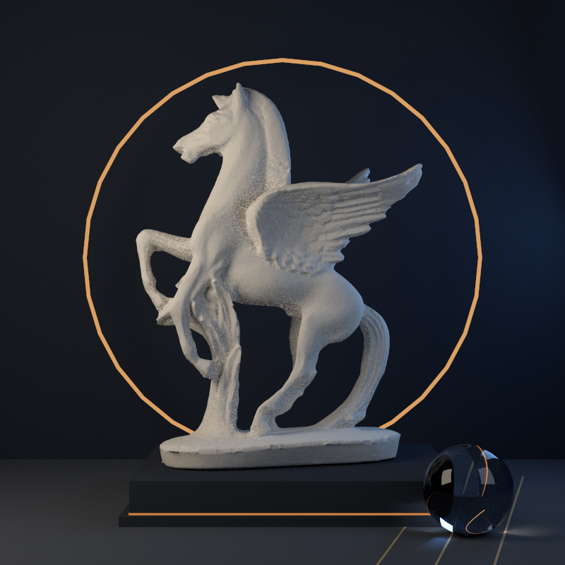
</p>

<p align="center">
  <i>CUDA path tracer featuring physically based rendering, procedural geometry, texture and bump mapping, arbitrary OBJ mesh loading, and BVH acceleration.</i>
</p>

## Table of Contents

### Part 1 - Core Path Tracer
- [1.1 Diffuse BSDF and Multi-Bounce Path Tracing](#11-diffuse-bsdf-and-multi-bounce-path-tracing)
- [1.2 Stream Compaction](#12-stream-compaction)
- [1.3 Material Sorting](#13-material-sorting)
- [1.4 Stochastic Sampled Antialiasing](#14-stochastic-sampled-antialiasing)

### Part 2 - Additional Features
- [2.1 Russian Roulette Path Termination](#21-russian-roulette-path-termination)
- [2.2 Depth of Field](#22-depth-of-field)
- [2.3 Refraction and Fresnel Effects](#23-refraction-and-fresnel-effects)
- [2.4 Direct Lighting](#24-direct-lighting)
- [2.5 Low-Discrepancy Sampling](#25-low-discrepancy-sampling)
- [2.6 Motion Blur](#26-motion-blur)
- [2.7 Restartable Path Tracing](#27-restartable-path-tracing)
- [2.8 Procedural Shapes and Textures](#28-procedural-shapes-and-textures)
- [2.9 Texture Mapping and Bump Mapping](#29-texture-mapping-and-bump-mapping)
- [2.10 OBJ Mesh Loading](#210-obj-mesh-loading)
- [2.11 BVH Acceleration](#211-bvh-acceleration)

### Part 3 - Final Model Credit
- [Pegasus Model Credit](#part-3---final-model-credit)

## Part 1 - Core Path Tracer

The core renderer is a CUDA-based Monte Carlo path tracer supporting cosine-weighted diffuse scattering, multi-bounce indirect illumination, emissive surfaces, stream compaction, material sorting, and stochastic sampled antialiasing.

The primary ray is produced for each pixel starting from the camera. Based on the material and the outcome of the ray-scene intersection, the light ray terminates or continues to scatter. The above procedure repeats itself until the ray intersects with an emissive surface, exits the scene, or achieves its maximum depth of bounces.

---

### 1.1 Diffuse BSDF and Multi-Bounce Path Tracing

For diffuse surfaces, I implemented cosine-weighted hemisphere sampling using the provided `calculateRandomDirectionInHemisphere()` function. At every diffuse intersection, the current path throughput is multiplied by the material color:

```cpp
pathSegment.color *= material.color;
```

The ray origin is moved to the current surface intersection and a new direction is randomly sampled in the hemisphere around the surface normal. Conceptually, each path follows:

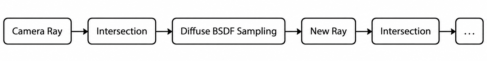

When a path reaches an emissive material, its accumulated throughput is multiplied by the light color and emittance:

```cpp
path.color *= material.color * material.emittance;
```

The path then terminates. If a ray leaves the scene without reaching a light source, its contribution is set to zero. The renderer therefore supports indirect illumination through multiple diffuse bounces. This produces effects such as the red and green color bleeding visible in the Cornell box.

#### Early Multi-Bounce Result

The image below shows an early working result shortly after multi-bounce diffuse path tracing was enabled. At this point, the image is still dominated by Monte Carlo noise, but indirect illumination and color bleeding are already visible.

<p align="center">
  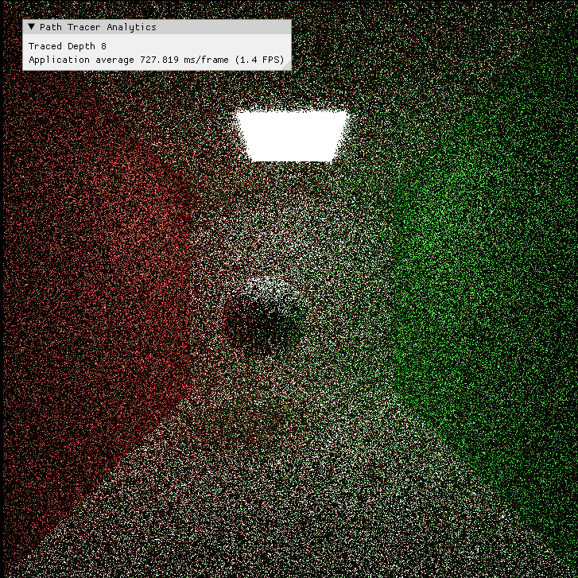
</p>

---

### 1.2 Stream Compaction

Many rays that bounce around the scene have paths that end before they get to the trace depth limit.

A path terminates when:

- it reaches an emissive surface,
- it escapes the scene, or
- it reaches the maximum allowed bounce depth.

Processing terminated rays is wasteful since they cannot contribute to any image generation. Therefore, stream compaction is done after each bounce. The rendering loop follows the structure below:

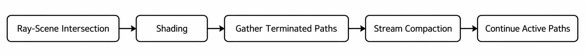

The contribution of the final color from each terminated path to the image buffer is made by adding it to its respective `pixelIndex`. The terminated paths are deleted from the list of active paths. The total count of active paths is obtained from the new end of the path buffer:

```cpp
num_paths = static_cast<int>(dev_path_end - dev_paths);
```

The rendering loop continues until no active paths remain.

#### Active Rays per Bounce: Open vs. Closed Scene

The effectiveness of stream compaction depends strongly on scene geometry. In an open scene, rays can escape the scene and terminate early. In a closed scene, rays are surrounded by geometry and are more likely to remain active for additional bounces (for the closed scene, I added a front wall at `z = +5`, then moved the camera inside the box so that rays could no longer escape through the open front, this modified scene is saved as `scenes/cornell_closed.json`). The contrast of two scenes is shown below.

<table>
<tr>
<td align="center" width="50%">
<b>Open Scene</b><br><br>
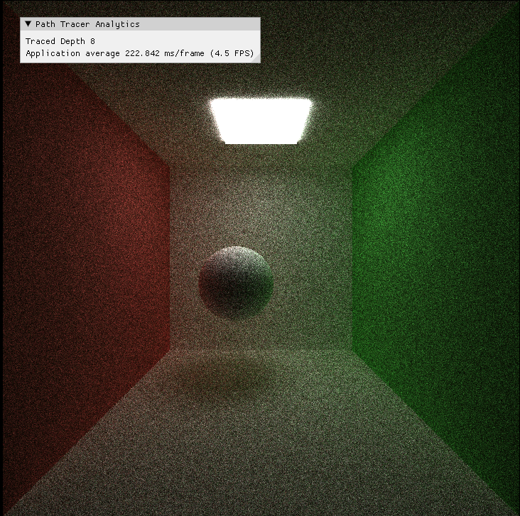
</td>
<td align="center" width="50%">
<b>Closed Scene</b><br><br>
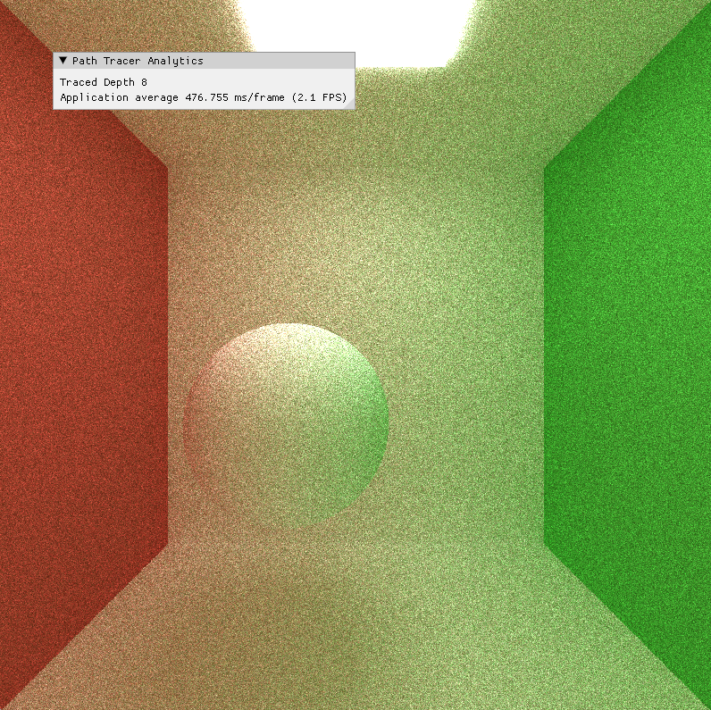
</td>
</tr>
</table>

The following active-ray counts were collected across all bounce depths within a single rendering iteration.

| Scene / Bounce |      0 |      1 |      2 |      3 |      4 |      5 |      6 |      7 | 8 |
| -------------- | -----: | -----: | -----: | -----: | -----: | -----: | -----: | -----: | -: |
| Open Scene     | 640000 | 523164 | 360348 | 277462 | 221273 | 179171 | 145828 | 119308 | 0 |
| Closed Scene   | 640000 | 622757 | 612276 | 601630 | 591352 | 581445 | 571626 | 561930 | 0 |

<p align="center">
  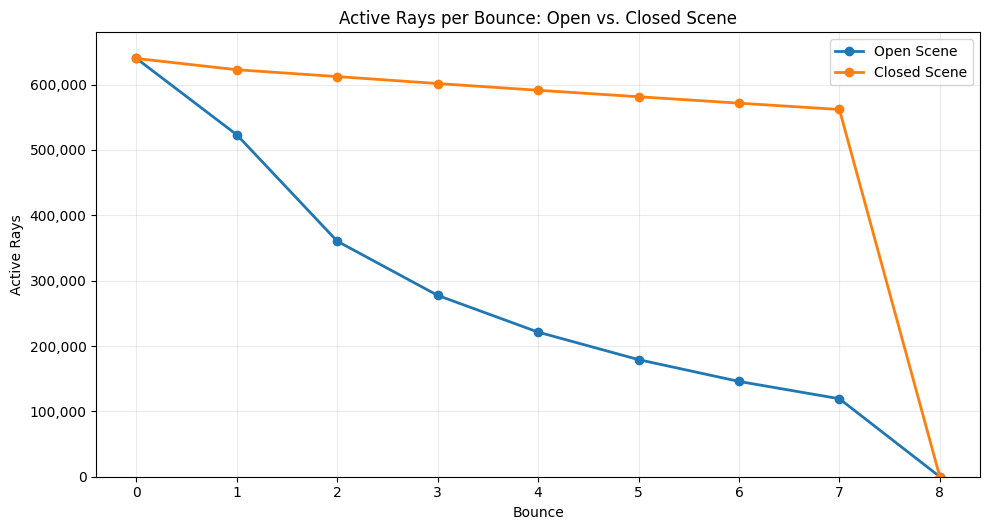
</p>

The difference is significant. By bounce 7, the open scene contains only 119,308 active rays, while the closed scene still contains 561,930 active rays. In the open scene, many rays escape and terminate early, allowing stream compaction to remove a large amount of inactive work before later intersection and shading stages. In the closed scene, rays remain enclosed by geometry and continue bouncing between surfaces, so substantially more paths remain active. This gives stream compaction a much greater opportunity to reduce unnecessary GPU work in the open scene.

The drop to zero at bounce 8 is caused by the maximum trace depth of 8, which forces all remaining paths to terminate.

#### Stream Compaction Performance

All performance measurements were collected using the Release build at 800×800 resolution with a maximum trace depth of 8. Material sorting and stochastic antialiasing were disabled, and error checking was disabled during timing. For each scene, the only changed variable was whether stream compaction was enabled or disabled.

| Scene  | Stream Compaction | Time / Frame |  FPS |
| ------ | ----------------- | -----------: | ---: |
| Open   | OFF               |    84.298 ms | 11.9 |
| Open   | ON                |    40.616 ms | 24.6 |
| Closed | OFF               |   102.587 ms |  9.7 |
| Closed | ON                |   103.924 ms |  9.6 |

#### Analysis

Stream compaction offers considerable performance gain in the open scene. The average frame time decreases from **84.298 ms** to **40.616 ms**, that is, by about **51.8%**, and the frame rate grows from **11.9 FPS** to **24.6 FPS**. It implies **2.08× speedup**.

This outcome is fully consistent with the active-ray measurements above. In the open scene, numerous rays escape or get terminated within the first several bounces so that the number of active paths drops from 640,000 primary rays to only 119,308 by bounce 7. Stream compaction discards these terminated paths, enabling the intersection and shading kernels to process a substantially reduced amount of data.

On the other hand, there is no performance gain achieved in the closed scene through stream compaction. The frame time rises slightly from **102.587 ms** to **103.924 ms**, i.e., about **1.3%**, while the frame rate stays almost the same at **9.7 FPS** and **9.6 FPS**, respectively. In the closed scene, the rays cannot escape easily and 561,930 out of 640,000 initial rays remain active at bounce 7. As a consequence, not a lot of paths can be discarded, making the reduction of GPU work negligible compared to the cost of performing stream compaction.

These results demonstrate that the effectiveness of stream compaction depends strongly on how quickly paths terminate. It is highly beneficial for open scenes with substantial early ray termination, but can introduce unnecessary overhead in closed scenes where most rays remain active until the maximum path depth.

---

### 1.3 Material Sorting

Different material types may require different BSDF calculations. When neighboring GPU threads evaluate different material branches, warp divergence can reduce shading efficiency. To improve shading coherence, I implemented material-based path sorting before the shading stage. After ray-scene intersection, each active path receives a sorting key corresponding to the `materialId` of its intersection. The rendering pipeline becomes:

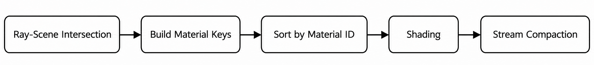

The material IDs are used as sorting keys while the corresponding `PathSegment` and `ShadeableIntersection` data remain paired during sorting.  Paths that interact with the same material are stored contiguously in memory after sorting before shading. Material sorting can be disabled/enabled for direct comparison of performance difference due to it.

#### Material Sorting Performance

| Configuration        | Time / Frame |  FPS |
| -------------------- | -----------: | ---: |
| Material Sorting OFF |   37.128 ms | 26.9 |
| Material Sorting ON  |     73.836ms | 13.5 |

#### Analysis

Material sorting did not improve performance for the current Cornell box scene. With material sorting disabled, the renderer required **37.128 ms/frame**, while enabling material sorting increased the frame time to **73.836 ms/frame**. This corresponds to an approximately **98.9% increase in frame time**, meaning that the sorted version was almost twice as slow in this test.

The primary reason is that material sorting introduces additional work at every bounce. Material keys must first be generated, and `thrust::sort_by_key` must then reorder the active paths and their corresponding intersections before shading. This sorting and memory movement adds a significant amount of overhead.

In the current renderer, the majority of non-emissive surfaces share the same diffuse BSDF. Even if the surfaces on the red, green, and white Cornell boxes are of different materials, the shading process for all of them is almost the same. Consequently, there is no sufficient material-dependent divergence caused by the shading kernel to enable the gain from sorting.

Material sorting is expected to become more useful in scenes containing a larger variety of computationally different BSDFs, such as diffuse, specular, and refractive materials. In those cases, grouping paths by material can reduce divergence more substantially and may better offset the cost of sorting.

---

### 1.4 Stochastic Sampled Antialiasing

#### Sampling Pattern

Without stochastic antialiasing, every iteration traces the camera ray through the same fixed sub-pixel location. Repeatedly sampling the same location can produce visible aliasing along high-contrast geometry boundaries. To address this, I implemented stochastic sampled antialiasing by jittering the primary ray independently in both the x and y directions for every pixel and every iteration:

```cpp
float jitterX = u01(rng);
float jitterY = u01(rng);

float sampleX = (float)x + jitterX;
float sampleY = (float)y + jitterY;
```

This causes each iteration to sample a slightly different sub-pixel location. Over many iterations, these samples are averaged together, producing smoother estimates of pixel coverage and reducing jagged edges.

<table>
<tr>
<td align="center" width="50%">
<b>Single Fixed Sample per Pixel</b><br><br>
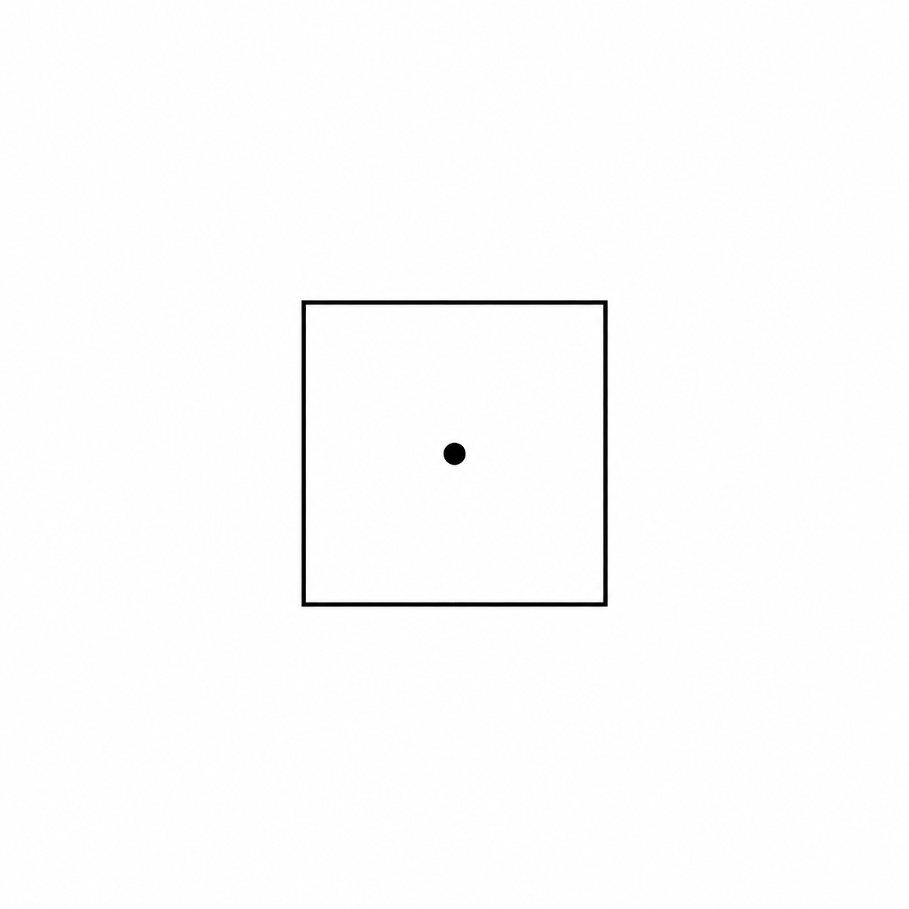
</td>
<td align="center" width="50%">
<b>Random Jittered Samples per Pixel</b><br><br>
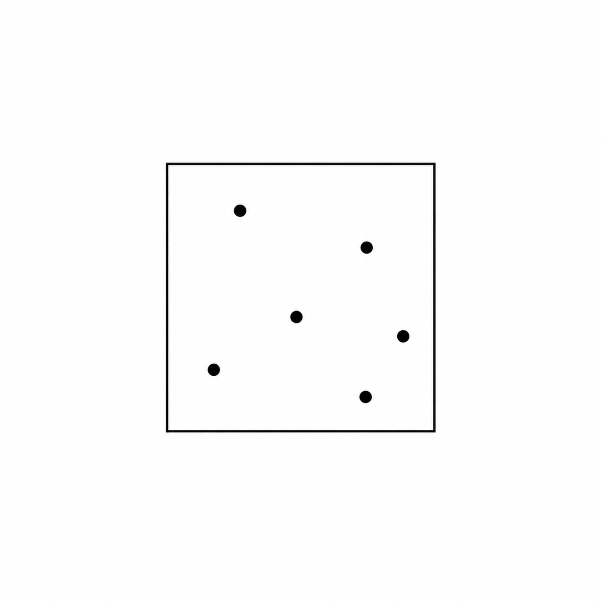
</td>
</tr>
</table>

#### Visual Comparison

The effect of stochastic antialiasing is most visible along object silhouettes and lighting boundaries. The following comparison was rendered using the same scene and settings, with antialiasing disabled on the left and enabled on the right.

<table>
<tr>
<td align="center" width="50%">
<b>Antialiasing OFF</b><br><br>
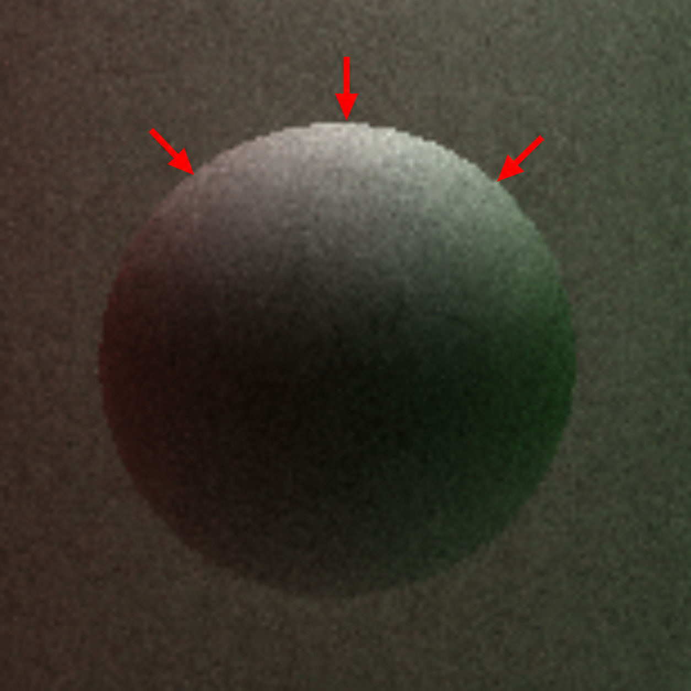
</td>
<td align="center" width="50%">
<b>Stochastic Antialiasing ON</b><br><br>
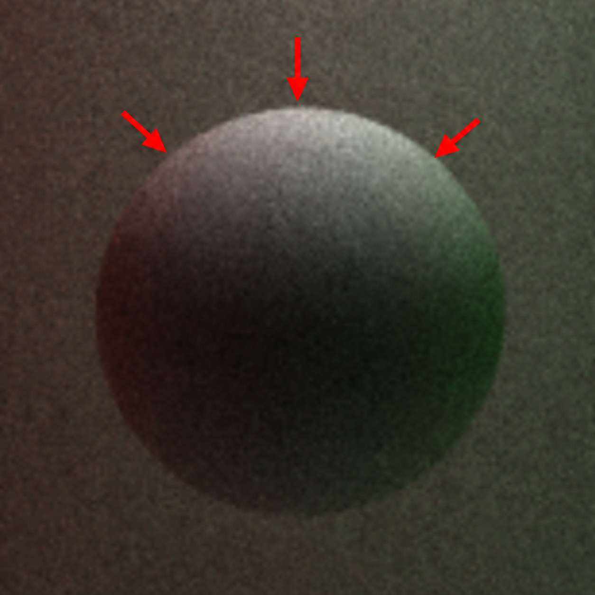
</td>
</tr>
</table>

#### Analysis

Based on the antialiasing test, the results show that stochastic sampled antialiasing enhances the appearance of the sphere silhouette due to reduced stair-case effect on the object boundary. From the image without antialiasing, one can see that the edge of the sphere looks more pixelated since the sampling takes place from the same sub-pixel coordinates per iteration. However, when antialiasing is applied, each iteration jitters the sampled position within the pixel so as to get an accurate average approximation of partial pixel coverage.

The greatest improvement is seen on the curved outer boundary of the sphere particularly the upper left and right edges that have been marked on the comparison images. While both renderings possess Monte Carlo noise, antialiased rendering keeps the silhouette smooth. This means that stochastic sub-pixel sampling makes edge quality better.

---

## Part 2 - Additional Features

### 2.1 Russian Roulette Path Termination

Termination of Russian roulette was introduced to avoid performing too much work that will not affect the final rendering result, because after several bounces the throughput of the path may be extremely low, but without the termination of the path the calculation will go on up to the maximum depth of tracing.

Russian roulette begins after bounce 3. The survival probability of a path is estimated from the largest component of its current throughput:

```cpp
float survivalProbability = fmaxf(
    pathSegments[idx].color.x,
    fmaxf(
        pathSegments[idx].color.y,
        pathSegments[idx].color.z
    )
);

survivalProbability = fminf(
    0.95f,
    fmaxf(0.05f, survivalProbability)
);
```

A random value is then generated to determine whether the path survives:

```cpp
float rouletteSample = u01(rng);

if (rouletteSample > survivalProbability)
{
    pathSegments[idx].color = glm::vec3(0.0f);
    pathSegments[idx].remainingBounces = 0;
}
else
{
    pathSegments[idx].color /= survivalProbability;
}
```

Those paths which do not pass the test are stopped right away and subsequently discarded through stream compaction. The paths which survive then divide their throughput by the survival probability. This is done to take into account those paths which were stopped.

#### Visual and Performance Comparison

The two images below were rendered using the same scene and rendering parameters. At approximately 500 iterations, the results are visually very similar, which is expected because Russian roulette should reduce computation without systematically changing the final image brightness.

<table>
<tr>
<td align="center" width="50%">
<b>Russian Roulette OFF</b><br><br>
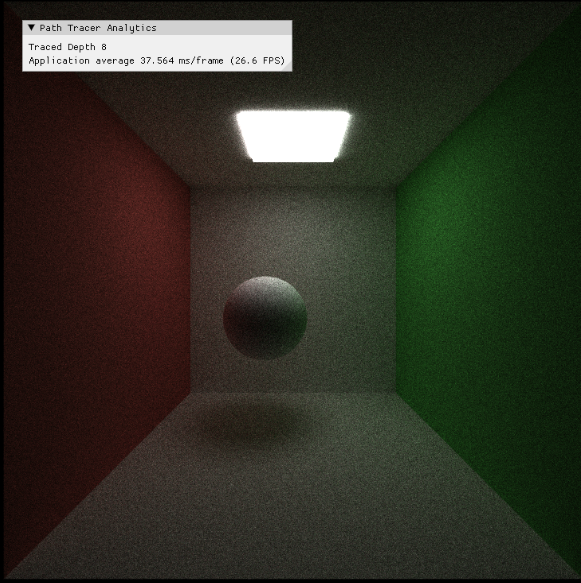
</td>
<td align="center" width="50%">
<b>Russian Roulette ON</b><br><br>
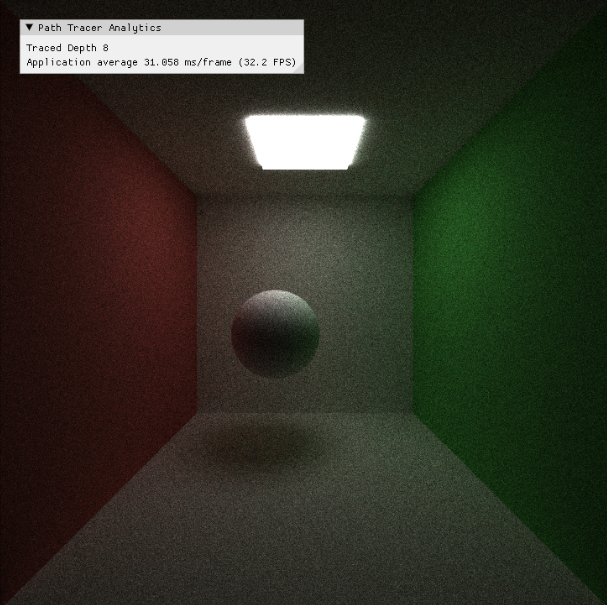
</td>
</tr>
</table>

The performance comparison was collected using the Release build with the same resolution, trace depth, scene, and rendering settings. Stream compaction was enabled, while material sorting and stochastic antialiasing were disabled. The only changed variable was whether Russian roulette was enabled.

| Russian Roulette | Time / Frame |  FPS |
| ---------------- | -----------: | ---: |
| OFF              |    37.564 ms | 26.6 |
| ON               |    31.058 ms | 32.2 |

#### Analysis

Enabling Russian roulette reduced the average frame time from 37.564 ms to 31.058 ms, corresponding to approximately a **17.3% reduction in frame time** and a **1.21× speedup**. The displayed frame rate increased from 26.6 FPS to 32.2 FPS.

The improvement in performance is due to the ability of killing low-throughput paths before reaching the maximum depth of trace. After paths have been killed, stream compaction will remove them from the active path buffer, allowing less paths to be processed in subsequent stages such as intersection and shading.

The quality of the rendering remains virtually the same because the survivors are split according to their probability of survival. Thus, Russian roulette is a method that sacrifices sampling variance for computational savings.

#### GPU vs. Hypothetical CPU Implementation

Russian roulette is well-suited for GPU path tracing, since each individual path can calculate the probability of survival based on its own throughput and a random sample. Thus, many such decisions can be calculated in parallel. The CPU version will employ the same probability calculation method, but it will work on far fewer paths at any given time. With the GPU implementation, there is a chance that irregular path termination will cause thread divergence in neighboring threads, which can be mitigated through stream compaction.

#### Further Optimization

The currently implemented algorithm is that of using the maximum RGB throughput component as the probability of survival and performing the Russian roulette test from bounce 3. These values can be optimized according to the nature of the particular scene. For instance, luminance can be used instead of the maximum RGB component for evaluating the contribution of a certain ray. It can also be decided upon where to begin the Russian roulette test based on adaptive sampling.

---

### 2.2 Depth of Field

Physically-based depth of field was implemented using a thin-lens camera model. Instead of generating every primary ray from exactly the same camera position, the ray origin is randomly sampled across a circular aperture. Each sampled ray is then redirected toward the same focal plane.

The aperture position is sampled uniformly over a disk:

```cpp
float lensU = u01(rng);
float lensV = u01(rng);

float radius = DOF_APERTURE_RADIUS * sqrtf(lensU);
float angle = 6.28318530718f * lensV;

glm::vec3 lensOffset =
    cam.right * (radius * cosf(angle))
    + cam.up * (radius * sinf(angle));
```

The original camera ray is used to determine a point on the focal plane:

```cpp
glm::vec3 viewDirection = glm::normalize(cam.view);

float focusT =
    DOF_FOCAL_DISTANCE /
    glm::dot(primaryDirection, viewDirection);

glm::vec3 focalPoint =
    cam.position + primaryDirection * focusT;
```

The primary ray is then moved to the sampled aperture position and redirected toward the focal point:

```cpp
segment.ray.origin =
    cam.position + lensOffset;

segment.ray.direction =
    glm::normalize(
        focalPoint - segment.ray.origin
    );
```

The aperture radius controls the strength of the depth-of-field effect, while the focal distance determines the plane that remains sharp. A larger aperture produces stronger blur for objects away from the focal plane.

#### Visual and Performance Comparison

In order to facilitate the observation of the depth of field effect, I have created a special setting wherein there are three balls at different distances from the camera. The green ball is situated at the focal plane while the red ball is closer to the camera compared to the blue ball.

<table>
<tr>
<td align="center" width="50%">
<b>Depth of Field OFF</b><br><br>
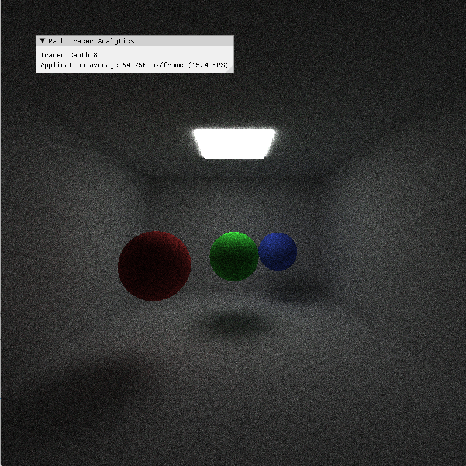
</td>
<td align="center" width="50%">
<b>Depth of Field ON</b><br><br>
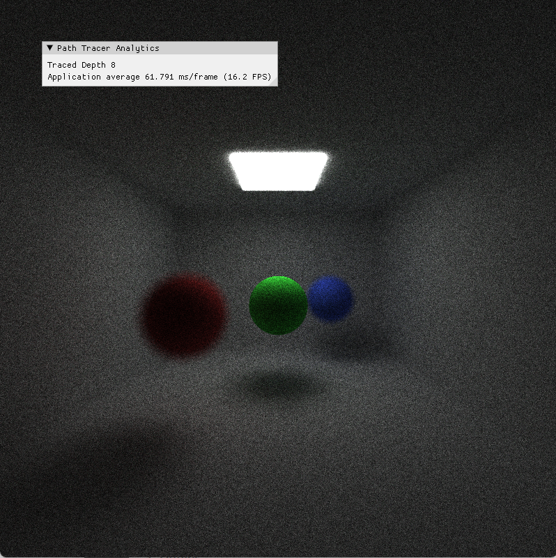
</td>
</tr>
</table>

Without depth of field, all three spheres look equally sharp. With depth of field turned on, the middle sphere stays in focus, while the red one closer to the observer and the blue one further away appear blurred.

Performance testing was done with the Release build in the same scene, resolution, trace depth, and other rendering parameters. Stream compaction was turned on, but material sorting, stochastic antialiasing, and Russian roulette were turned off. Depth of field was the only variable tested here.

| Depth of Field | Time / Frame |  FPS |
| -------------- | -----------: | ---: |
| OFF            |   64. 750 ms | 15.4 |
| ON             |   61. 791 ms | 16.2 |

#### Analysis

The depth of field example shows how sampling of the primary rays through a finite aperture works. Without depth of field, all three spheres will be equally sharp regardless of their distance from the camera. However, when depth of field is activated, the central green sphere is still in focus while the red one that is closer to the camera and the blue sphere that is farther from it are both out of focus and thus blurred.

It is explained by the convergence of the rays emitted from different parts of the aperture near the focal plane. For those objects that are off the focal plane, the rays hit different locations on the object. The differences average out during multiple iterations.

In the measurement experiment, the frame time shifted from 64.750 ms when depth of field was turned off to 61.791 ms when the feature was on. This very slight difference is not enough for suggesting any performance enhancement because of depth of field. In addition, since depth of field performs just a couple of additional samples and calculations, which take much less time than those of the intersection and shading process, then the measurement difference might be a run-to-run difference.

#### GPU vs. Hypothetical CPU Implementation

The algorithm depth of field is quite suitable for implementation on the GPU since each pixel computes independently its aperture point and constructs its main ray. The algorithm depth of field implemented on the CPU would involve the same thin lens computations, but the number of rays would be much smaller. The advantage that the GPU has from the independence of the algorithm is the lack of necessity in communication between the pixels. Depth of field computations thus do not add much overhead to the rendering cost.

#### Further Optimization

The current implementation utilizes compile-time constants for the aperture radius and focal distance. These could have been set through the camera configuration within the scene file, providing for the possibility of having independent focus settings for every scene without requiring any recompilation of the renderer. There is the possibility of further extending the implementation with the use of other aperture shapes or lens sampling techniques.

---

### 2.3 Refraction and Fresnel Effects

Refraction was implemented to support transparent dielectric materials such as glass. A refractive material stores an index of refraction (IOR), which determines how much the ray bends when passing between air and the material.

A glass material can be defined directly in the scene file:

```json
"glass": {
    "TYPE": "Refractive",
    "RGB": [1.0, 1.0, 1.0],
    "IOR": 1.5
}
```

During ray-scene intersection, the renderer records whether the ray is entering or leaving the object. This is necessary because the refractive index ratio changes depending on the direction of travel:

```cpp
if (outside)
{
    n1 = 1.0f;
    n2 = m.indexOfRefraction;
}
else
{
    n1 = m.indexOfRefraction;
    n2 = 1.0f;
}

float eta = n1 / n2;
```

The reflected and refracted directions are computed using `glm::reflect` and `glm::refract`. Fresnel reflection is approximated using Schlick's approximation:

```cpp
float r0 = (n1 - n2) / (n1 + n2);
r0 = r0 * r0;

float oneMinusCos = 1.0f - cosTheta;

float reflectProbability =
    r0 +
    (1.0f - r0) *
    oneMinusCos *
    oneMinusCos *
    oneMinusCos *
    oneMinusCos *
    oneMinusCos;
```

A random sample determines whether the path reflects or refracts:

```cpp
if (totalInternalReflection ||
    randomSample < reflectProbability)
{
    newDirection =
        glm::reflect(
            incomingDirection,
            surfaceNormal
        );
}
else
{
    newDirection =
        glm::refract(
            incomingDirection,
            surfaceNormal,
            eta
        );
}
```

Total internal reflection is also handled when a ray attempts to leave a higher-index material at an angle where no valid refracted direction exists.

#### Visual and Performance Comparison

To clearly demonstrate the effect of refraction, I created a dedicated test scene containing a glass sphere placed in front of colored vertical stripes. This makes the distortion of the background through the glass easy to observe.

<table>
<tr>
<td align="center" width="50%">
<b>Refraction OFF</b><br><br>
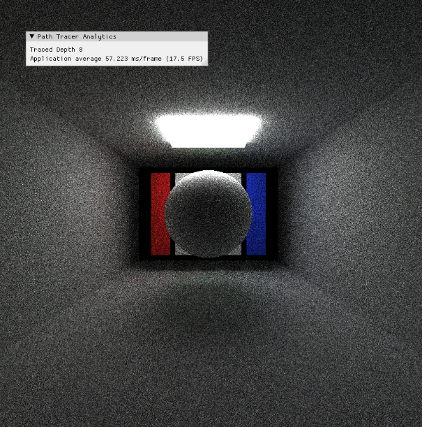
</td>
<td align="center" width="50%">
<b>Refraction ON</b><br><br>
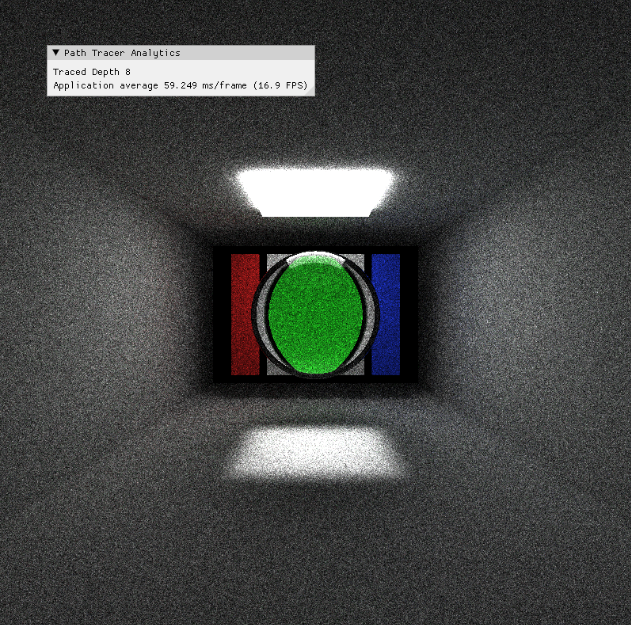
</td>
</tr>
</table>

Without refraction, the glass material becomes diffuse again and the sphere acts as an opaque object, hiding the colorful background behind. With refraction turned on, rays can penetrate the sphere and hit the surfaces behind it. The colored lines become visible in the sphere and are distorted due to the change in direction of rays on both glass interfaces.

This performance analysis was done using the Release build with the same scene, resolution, trace depth, and other parameters for rendering. Stream compaction was used, but material sorting, stochastic antialiasing, Russian roulette, and depth of field were not. The only difference was the use of refraction.

| Refraction | Time / Frame |  FPS |
| ---------- | -----------: | ---: |
| OFF        |    24.305 ms | 41.1 |
| ON         |    59.249 ms | 16.9 |

#### Analysis

Enabling refraction significantly increases the amount of work required to trace paths through the scene. In the measured test, the average frame time increased from 24.305 ms to 59.249 ms, corresponding to approximately a **143.8% increase in frame time**. The displayed frame rate decreased from 41.1 FPS to 16.9 FPS.

Extra cost results from the following reasons. Refractive rays need a Fresnel computation, reflections, and refractions, as well as further ray bounces through both entry and exit faces of the glass object. On the other hand, without refractions, the sphere acts like any regular diffuse surface without further dielectric computations.

However, the difference between the two cases is greater than one might expect based on the extra computational cost. Enabling refractions makes it possible to see the colored background behind the sphere and even distorts it. Also, there is greater Fresnel reflection near the curved exterior surface of the sphere, while more rays pass through normal viewing areas.

#### GPU vs. Hypothetical CPU Implementation

The refraction function lends itself to GPU path tracing since each path makes an independent decision on whether or not to go through a refractive object based on the Fresnel probability and either calculates the reflected or refracted ray. A hypothetical CPU solution would do the same calculations for reflection, refraction, and Fresnel, although for a much smaller number of paths at once. On the other hand, materials with refraction can create some GPU warp divergence, as neighboring rays can take their own paths for reflection or transmission.

#### Further Optimization

Currently, Schlick’s approximation is employed in the implementation since it is an effective means of estimating Fresnel reflectance at a reasonable cost and produces visually plausible dielectric behavior. Optimization could be made possible by grouping refractive rays before shading to promote instruction-level coherence. In addition, other complicated dielectric behavior can be supported such as absorbing colored glass, rough refraction, nesting dielectric surfaces, and more realistic Fresnel calculations.

---

### 2.4 Direct Lighting

Direct lighting was implemented by  sampling a point from a random emissive area light whenever a diffuse surface is intersected with the scene. This method enables the rendering engine to cast a shadow ray towards the light source without having to depend on randomly scattered rays.

A random point is sampled on the rectangular emissive light:

```cpp
float u = u01(rng) - 0.5f;
float v = u01(rng) - 0.5f;

glm::vec3 localLightPoint(
    u,
    -0.5f,
    v
);

glm::vec3 lightPoint =
    multiplyMV(
        light.transform,
        glm::vec4(localLightPoint, 1.0f)
    );
```

The direction and distance from the current surface point to the sampled light position are then computed:

```cpp
glm::vec3 toLight =
    lightPoint - intersectPoint;

float distanceSquared =
    glm::dot(toLight, toLight);

float distance =
    sqrtf(distanceSquared);

glm::vec3 lightDirection =
    toLight / distance;
```

A shadow ray is traced toward the light to determine whether the sampled point is visible. If another object intersects the shadow ray before it reaches the light, the direct-light contribution is discarded.

For a visible light sample, the contribution is weighted by the surface cosine, light cosine, light area, and inverse-square distance:

```cpp
glm::vec3 directContribution =
    pathSegment.color *
    surfaceMaterial.color *
    emittedLight *
    (
        surfaceCos *
        lightCos *
        lightArea /
        (PI * distanceSquared)
    );
```

The renderer still continues the normal diffuse path afterward, allowing indirect illumination to be accumulated in addition to the explicitly sampled direct lighting.

#### Visual and Performance Comparison

The following images were captured from the same Cornell box scene at exactly **50 iterations**. All rendering settings were kept identical except for the direct-lighting toggle.

<table>
<tr>
<td align="center" width="50%">
<b>Direct Lighting OFF</b><br><br>
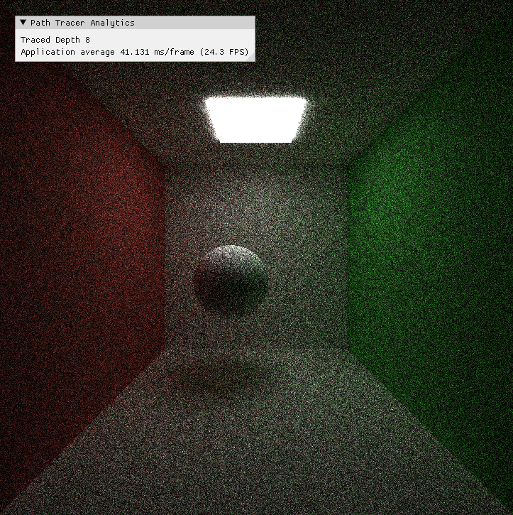
</td>
<td align="center" width="50%">
<b>Direct Lighting ON</b><br><br>
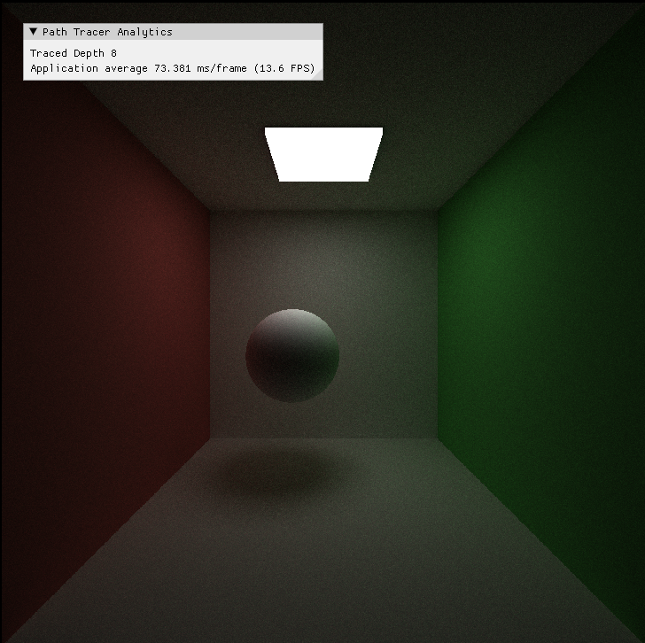
</td>
</tr>
</table>

The difference in convergence at the same number of iterations is rather great. In the absence of direct lighting, the scene still suffers from Monte Carlo noise, as diffuse rays have to randomly hit the light source. With direct lighting on, the surfaces get their own light samples at each iteration, thus creating cleaner lighting and shadows.

This performance test was made with the Release build, with the same scene, resolution, trace depth, and rendering parameters. Stream compaction was used, but no material sorting, stochastic antialiasing, Russian roulette, depth of field, or refractions.

| Direct Lighting | Time / Frame |  FPS |
| --------------- | -----------: | ---: |
| OFF             |    41.131 ms | 24.3 |
| ON              |    73.381 ms | 13.6 |

#### Analysis

Enabling direct lighting increased the average frame time from 41.131 ms to 73.381 ms, corresponding to approximately a **78.4% increase in frame time**. The displayed frame rate decreased from 24.3 FPS to 13.6 FPS.

Even though the complexity grows with each iteration, the speed of convergence is much faster as seen in the images. The difference can be seen in just 50 iterations where the direct lighting result looks a lot smoother as opposed to the baseline image that is still noisy due to Monte Carlo effect. Thus, the increased computational cost makes up for fewer necessary iterations to produce a clean image.

This performance overhead is caused by the extra light sample and shadow rays per diffuse surface hit. This shadow ray has to be tested against the geometry once again in order to see if it is obstructed by any object. Nevertheless, explicit sampling of the light source significantly raises the chances of producing useful direct light information.

#### GPU vs. Hypothetical CPU Implementation

Direct illumination is very appropriate for GPU rendering since each lighting point can compute the effect of the illumination independently and in parallel. In contrast, the same operations will be carried out with a CPU program, but far fewer shadow rays will be computed simultaneously. The problem with the GPU is the possible divergence between rays due to the difference in their visibility computations and geometry intersection computations of the neighboring threads. Nevertheless, the number of independent rays ensures good parallelism for the lighting computations.

#### Further Optimization

The current implementation checks the intersection of the shadow rays with the scene geometry in an unoptimized way. This can be made much faster by implementing a spatial data structure like a BVH, which would allow reducing the number of intersection tests with the geometry. At the moment, the renderer samples one sample from one light source rectangle per shading process. In future, more samples can be taken or sampled not uniformly but rather in proportion to their contribution.

---

### 2.5 Low-Discrepancy Sampling

To increase the quality of sampling, low-discrepancy hemisphere sampling via a 2D Halton sequence was introduced. The difference between random sampling and Halton sampling is that the latter generates more evenly spaced samples, thereby generating fewer clusters and producing a smoother noise with fewer iterations.

I implemented a Halton sequence generator for 1D and expanded it to be a 2D sampler with bases of 2 and 3. Whenever the low-discrepancy flag is set to true, for each ray tracing path, a 2D sample is generated based on the current iteration number, the pixel position, and the depth of the current bounce and used to generate a cosine-weighted hemisphere direction for diffuse scattering.

However, this does not affect the outcome of the light in the end because it is only the distribution of noise that gets improved, especially when there are very few iterations where the output image will converge evenly.

#### Visual Comparison and Performance

The following comparison was captured with direct lighting enabled at a low iteration count so that the difference in noise distribution is easier to observe.

<table>
<tr>
<td align="center" width="50%">
<b>Low-Discrepancy OFF (Random)</b><br><br>
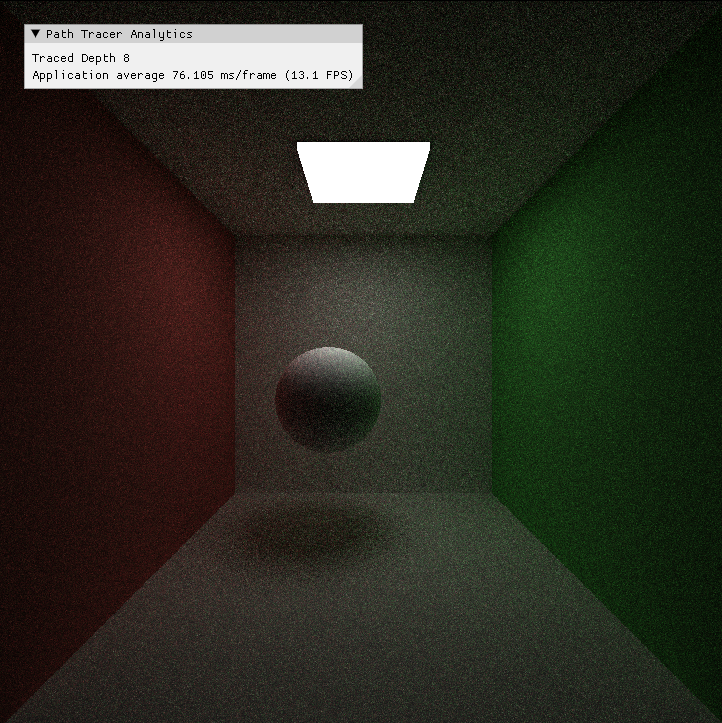
</td>
<td align="center" width="50%">
<b>Low-Discrepancy ON (Halton)</b><br><br>
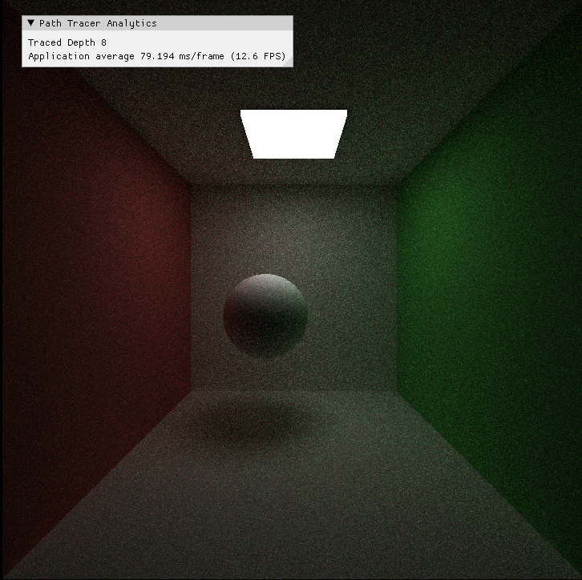
</td>
</tr>
</table>

To make the difference easier to see, I also include zoomed-in crops from the same image region. The Halton version shows finer and more evenly distributed noise, while the random version exhibits larger noise clumps.

<table>
<tr>
<td align="center"><b>Low-Discrepancy OFF (Random)</b></td>
<td align="center"><b>Low-Discrepancy ON (Halton)</b></td>
</tr>
<tr>
<td align="center">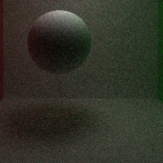</td>
<td align="center">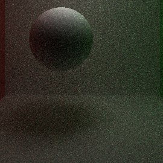</td>
</tr>
</table>

It is apparent mostly in the darker areas of the wall and floor around the sphere where the random sampler creates more noise due to larger sample grain and clusters in those areas. On the other hand, because the low discrepancy sampler provides a more even distribution of samples, its noise is more refined.

All performance results were obtained at 800x800 resolution using the Release configuration and a maximum trace depth of 8.

| Sampling Method                   | Time / Frame |  FPS |
| --------------------------------- | -----------: | ---: |
| Random Sampling                   |    76.105 ms | 13.1 |
| Low-Discrepancy Sampling (Halton) |    79.194 ms | 12.6 |

The Halton-based sampler is slightly slower, increasing frame time by about 4.1%, but it produces visibly better sample distribution at low iteration counts. This makes it a useful quality-oriented improvement, especially when the renderer is run for only a small number of iterations.

#### GPU vs. Hypothetical CPU Implementation

The low discrepancy sampling scheme works especially well for GPU rendering since the samples coordinates can be determined by each individual thread independently based on the current iteration, pixel index, and the bounce number. There is no need for communication between threads which makes the algorithm highly parallelizable. A potential CPU approach will employ the same principle of using Halton sequences but will evaluate many fewer paths at once. The GPU approach works especially well due to the low computational costs of the sampling step.

#### Further Optimization

Diffuse hemisphere sampling is currently achieved using a Halton sequence based on bases 2 and 3. There are several other ways in which the current approach can be enhanced by making use of Cranley-Patterson rotation, Owen scrambling, or other forms of low-discrepancy sequences. It may also be beneficial to extend low-discrepancy sampling from the current use on diffuse bounce direction sampling to camera sampling, depth of field lens sampling, or even direct light sampling.

### 2.6 Motion Blur

Motion blur was implemented by assigning each camera path a random time within a normalized shutter interval `[0, 1]`. Moving objects are assigned a translation vector that describes how far they move during this interval. Each ray stores its sampled time:

```cpp
segment.ray.time = MOTION_BLUR ? u01(rng) : 0.0f;
```

The time is generated only when the primary camera ray is created and remains unchanged throughout all subsequent bounces of the same path. This ensures that every bounce observes the scene at the same instant in time. Object motion can be specified directly in the scene file:

```json
"MOTION": [3.0, 0.0, 0.0]
```

For example, this specifies that the object moves three scene units along the X axis during the shutter interval. Instead of rebuilding the object's transformation matrices for every ray and every sampled time, the intersection calculation uses relative motion. The object's displacement at the ray's sampled time is:

```cpp
motionOffset = geom.motion * pathSegment.ray.time;
```

A temporary ray is then translated in the opposite direction:

```cpp
Ray motionRay = pathSegment.ray;
motionRay.origin -= motionOffset;
```

Moving an object by `+motionOffset` is equivalent, for intersection testing, to keeping the object stationary and translating the ray by `-motionOffset`. This allows the existing sphere and box intersection routines to be reused without rebuilding object transforms.

#### Visual and Performance Comparison

The following comparison uses the same scene and rendering settings, with the only difference being whether motion blur is enabled. The sphere moves horizontally along the X axis.

<table>
<tr>
<td align="center" width="50%">
<b>Motion Blur OFF</b><br><br>
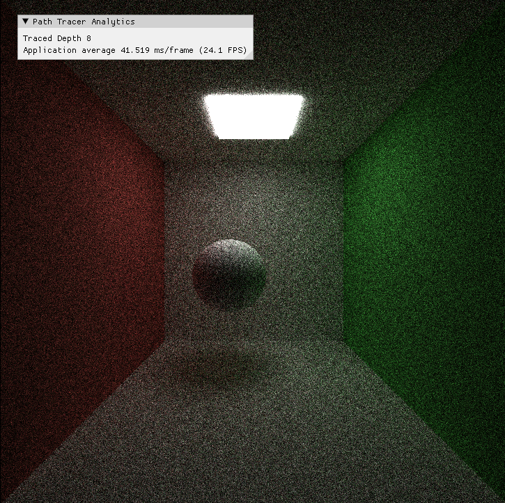
</td>
<td align="center" width="50%">
<b>Motion Blur ON</b><br><br>
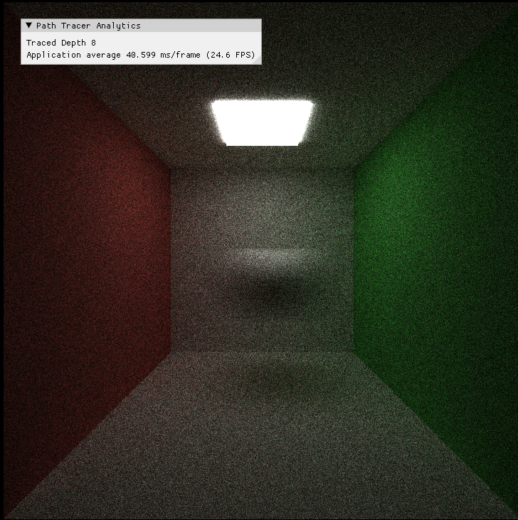
</td>
</tr>
</table>

With motion blur disabled, every ray observes the sphere at its original position, producing a sharp silhouette. With motion blur enabled, different paths observe the sphere at different positions during the shutter interval. After many samples are accumulated, the sphere becomes visibly stretched and blurred along its horizontal direction of motion. The floor shadow also becomes wider and softer because the moving object occupies different positions across the sampled times.

| Motion Blur | Time / Frame |  FPS |
| ----------- | -----------: | ---: |
| OFF         |    41. 519ms | 24.1 |
| ON          |    40.659 ms | 24.6 |

#### Analysis

The resulting motion-blurred image depicts a distinct horizontal motion blur aligned with the motion vector defined by the object itself. The use of a motion vector on the X axis causes the silhouette of the sphere to grow horizontally more than vertically.

As for the algorithm used, it does not duplicate the scene for each time sample, instead using the same static geometry and just changing the ray origin relative to the object's movement. This way the algorithm remains fairly simple while allowing each path to sample the motion at a different place.

In addition to the increased processing requirements caused by storing a time parameter for each ray and computing an offset for intersection tests, there is no additional path tracing bounce needed just for motion blur.

#### GPU vs. Hypothetical CPU Implementation

Motion blur can be naturally implemented using GPU path tracing since each camera path has an independent shutter time to be sampled. Thousands of rays can thus sample different shutter times at the same time without any need for thread coordination. A CPU implementation can utilize the same temporal sampling technique but will have fewer camera paths evaluated at once. Another benefit of using the relative motion intersection technique is that complete object transformation matrices do not need to be calculated per ray.

#### Further Optimization

Linear translations may be done currently while in a normalized shutter period. A more enhanced way to achieve this would be by allowing rotation of objects, non-linear paths and different timings for shutter opening and shutter closing. Static objects could move faster since the calculation for motion would not need to be done for objects that have zero motion vectors.

### 2.7 Restartable Path Tracing

A checkpoint system was implemented so that a long-running path-tracing session can be stopped and resumed later without discarding previously accumulated samples.

The checkpoint stores a small header containing the image resolution and current iteration:

```cpp
struct CheckpointHeader
{
    int width;
    int height;
    int iteration;
};
```

When a checkpoint is saved, the current iteration and accumulated floating-point image buffer are written directly to a binary file:

```cpp
file.write(reinterpret_cast<const char*>(&header), sizeof(header));
file.write(reinterpret_cast<const char*>(renderState->image.data()), renderState->image.size() * sizeof(glm::vec3));
```

The checkpoint can be saved interactively by pressing `C`.

When loading, the stored resolution is first checked against the current scene:

```cpp
if (header.width != width || header.height != height)
{
    std::cerr << "Checkpoint resolution does not match current scene." << std::endl;
    return;
}
```

The accumulated image samples and saved iteration are then restored:

```cpp
iteration = header.iteration;
pathtraceRestoreImage(renderState->image.data(), width * height);
```

Since rendering continues on the GPU, the recovered CPU image must also be copied back into the CUDA accumulation buffer:

```cpp
void pathtraceRestoreImage(const glm::vec3* image, int pixelcount)
{
    cudaMemcpy(dev_image, image, pixelcount * sizeof(glm::vec3), cudaMemcpyHostToDevice);
}
```

The checkpoint can be loaded interactively by pressing `L`.

#### Visual and Performance Comparison

The checkpoint system was tested by saving a rendering session at iteration 54, completely closing the renderer, restarting the same scene, and loading the saved checkpoint. The terminal output confirms that the checkpoint was saved at iteration 54 and that the new application instance successfully restored the same iteration.

<p align="center">
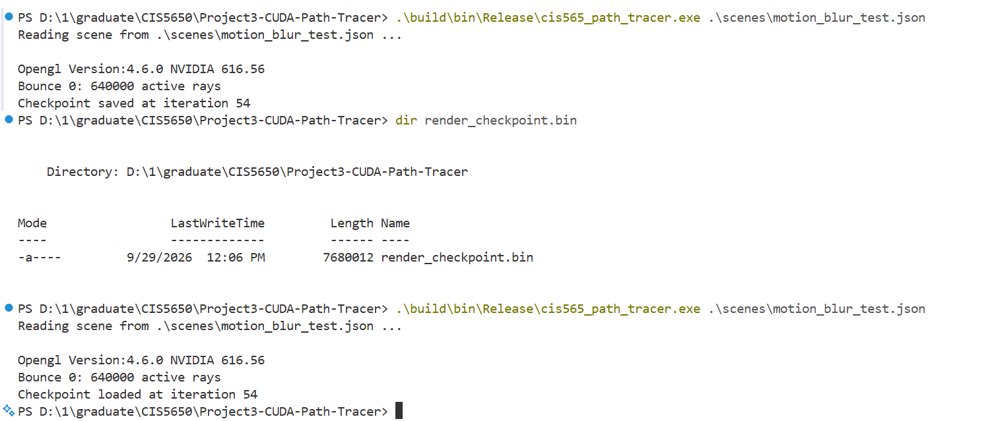
</p>

Unlike rendering features that modify the image itself, restartable path tracing does not change the visual result. Its purpose is to preserve previously accumulated rendering work across application sessions.

There is also no additional steady-state per-frame rendering cost. Checkpoint operations only occur when explicitly requested by the user. Saving performs a binary write of the accumulated image buffer and iteration state, while loading performs a binary read followed by one host-to-device `cudaMemcpy` to restore the CUDA accumulation buffer. Therefore, the feature introduces only a one-time I/O cost when saving or restoring a session.

#### Analysis

The test managed to preserve the rendering process at iteration 54 and restore the very same iteration when the program was relaunched. It is essential to save both the iteration number and the total image value since the current pixel color is calculated using the samples obtained up until now.

Saving only the iteration number will result in an erroneous picture since the radiance accumulated previously will be lost. The same way, saving only the image value without the iteration number means using the wrong normalization coefficient.

The implementation therefore restores both pieces of state: accumulated radiance butter & current iteration count. This allows long renders to be divided across multiple program executions without losing previous sampling work.

#### GPU vs. Hypothetical CPU Implementation

The checkpoint file itself is independent of the hardware because the accumulated image is saved as regular floating-point RGB values in CPU memory. This means that a CPU version of the path tracer could use almost identical saving/loading of checkpoints. The extra step for the CUDA version will be loading the accumulated image back into the GPU memory. Once the checkpoint file is loaded into the CPU buffer, the memory transfer will restore `dev_image`. Because this will happen just once at checkpoint loading time, there won't be any extra cost per render iteration.

#### Further Optimization

The current checkpoint saves the resolution of the image, the number of iterations, and the samples of the images saved so far. The next possible checkpoints would include other renderer settings like camera settings, the state of the random number generator, the scene definition, or acceleration structures. A scene identifier or hash may be saved in the checkpoint header as well, so that the renderer will be able to discard a checkpoint generated for another scene even if both scenes have the same resolution. Version numbers may also be saved in the checkpoint files to make sure the format is still compatible.

### 2.8 Procedural Shapes and Textures

I extended the renderer with two procedurally defined complex shapes and two procedurally generated surface textures. Unlike file-loaded meshes or image textures, both the geometry and the surface patterns are evaluated directly from mathematical functions at render time. The two procedural shapes are **Torus** and **Level-1 Menger Sponge**. The two procedural textures are **Checkerboard** and **Stripes**.

#### Procedural Torus

The torus is represented using a signed distance function (SDF). Two radii define the shape: the major radius controls the distance from the torus center to the center of the tube, while the minor radius controls the thickness of the tube.

```cpp
__host__ __device__ float torusSDF(glm::vec3 p)
{
    const float majorRadius = 0.35f;
    const float minorRadius = 0.15f;

    glm::vec2 q(glm::length(glm::vec2(p.x, p.z)) - majorRadius, p.y);

    return glm::length(q) - minorRadius;
}
```

The SDF returns a positive value outside the torus, approximately zero on the surface, and a negative value inside the geometry. Ray intersections are evaluated using sphere tracing. Starting from the ray origin, the renderer repeatedly evaluates the SDF and advances the ray by the returned distance:

```cpp
glm::vec3 p = q.origin + t * q.direction;
float distance = torusSDF(p);

if (fabsf(distance) < 0.001f)
{
    // surface hit
}

t += fabsf(distance);
```

This allows the renderer to intersect the torus without loading or tessellating a mesh.

#### Procedural Menger Sponge

The second procedural shape is a Level-1 Menger Sponge. It begins with a unit cube and subtracts three perpendicular rectangular tunnels through the center. A standard box SDF is first used as the basic building block:

```cpp
__host__ __device__ float boxSDF(glm::vec3 p, glm::vec3 halfSize)
{
    glm::vec3 q = glm::abs(p) - halfSize;
    glm::vec3 outside(fmaxf(q.x, 0.0f), fmaxf(q.y, 0.0f), fmaxf(q.z, 0.0f));

    float outsideDistance = glm::length(outside);
    float insideDistance = fminf(fmaxf(q.x, fmaxf(q.y, q.z)), 0.0f);

    return outsideDistance + insideDistance;
}
```

The three tunnels are combined using an SDF union, and then subtracted from the outer cube:

```cpp
float outerBox = boxSDF(p, glm::vec3(0.5f));

float holeX = boxSDF(p, glm::vec3(0.6f, holeRadius, holeRadius));
float holeY = boxSDF(p, glm::vec3(holeRadius, 0.6f, holeRadius));
float holeZ = boxSDF(p, glm::vec3(holeRadius, holeRadius, 0.6f));

float holes = fminf(holeX, fminf(holeY, holeZ));

return fmaxf(outerBox, -holes);
```

This construction creates the characteristic center and face openings of the first Menger subdivision without explicitly creating individual cubes. Both procedural shapes use finite differences to estimate their surface normals from their SDF:

```cpp
float dx = sdf(p + glm::vec3(e, 0.0f, 0.0f)) - sdf(p - glm::vec3(e, 0.0f, 0.0f));
float dy = sdf(p + glm::vec3(0.0f, e, 0.0f)) - sdf(p - glm::vec3(0.0f, e, 0.0f));
float dz = sdf(p + glm::vec3(0.0f, 0.0f, e)) - sdf(p - glm::vec3(0.0f, 0.0f, e));

return glm::normalize(glm::vec3(dx, dy, dz));
```

#### Procedural Textures

Procedural textures are evaluated directly from the intersection position rather than sampled from an image file. Each material can specify a texture type, a secondary color, and a texture scale:

```json
"checker": {
    "TYPE": "Diffuse",
    "RGB": [0.95, 0.95, 0.95],
    "TEXTURE": "checker",
    "TEXTURE_RGB": [0.20, 0.20, 0.20],
    "TEXTURE_SCALE": 5.0
}
```

The checkerboard texture divides space into alternating cells:

```cpp
int ix = (int)floorf(p.x * scale);
int iy = (int)floorf(p.y * scale);
int iz = (int)floorf(p.z * scale);

int checker = ((ix + iy + iz) % 2 + 2) % 2;

if (checker == 0) return material.color;
return material.textureColor;
```

The stripe texture alternates colors along the Y direction:

```cpp
int stripe = (int)floorf(p.y * scale);
stripe = (stripe % 2 + 2) % 2;

if (stripe == 0) return material.color;
return material.textureColor;
```

The procedural color is evaluated at the surface intersection before BSDF scattering:

```cpp
material.color = getProceduralTextureColor(material, intersectPoint);
```

Therefore, the same texture implementation can be applied to different geometry types without changing the intersection or shading algorithms.

#### Visual and Performance Comparison

To demonstrate that the procedural textures are independent of the underlying procedural geometry, I rendered the same scene twice while keeping the camera, object transforms, lighting, and rendering configuration unchanged. Direct lighting was enabled in both renders to make the Torus, Menger Sponge, and their surface patterns easier to distinguish. The only difference between the two renders is the assignment of the checkerboard and stripe materials. In the first render, the Torus uses the checkerboard texture while the Menger Sponge uses stripes. In the second render, the assignments are reversed.

<table>
<tr>
<td align="center" width="50%">
<b>Torus: Checker / Menger: Stripes</b><br><br>
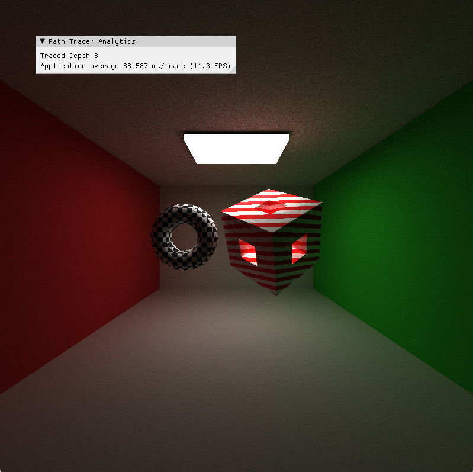
</td>
<td align="center" width="50%">
<b>Torus: Stripes / Menger: Checker</b><br><br>
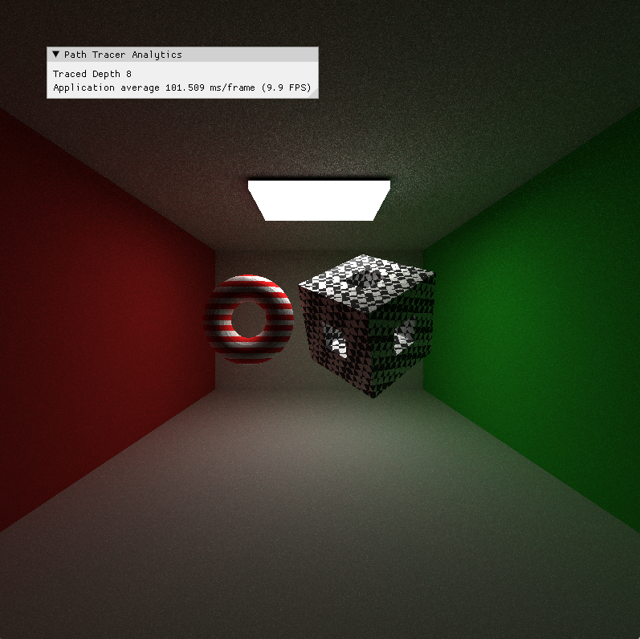
</td>
</tr>
</table>

Material swaps are proof that neither of these textures is intrinsically bound to a particular procedural primitive. The texture routines are calculated from the point of surface intersection and thus can be used with any geometry. Procedural scene rendering with direct light enabled took around **88.587 ms/frame (11.3 FPS)**. This data point was not intended to be a controlled feature comparison but rather serves as a reference point. Procedural geometry must be more costly than analytical sphere and cube intersections because each Torus and Menger intersection can involve several SDF calculations.

#### Analysis

The results prove that procedural geometry and procedural textures are independent of each other. The torus and menger sponge objects are procedurally constructed by using SDFs and sphere tracing methods. On the other hand, the checkerboard and stripes are procedurally calculated based on the surface intersection point. It can be seen that when the two textures are switched between the two objects, the results will only change in the appearance of the surface.

The high performance cost is due to the procedural geometry not the textures. This means that torus and menger intersection involves several SDFs evaluations through sphere tracing while the checkers and stripes need just some mathematical operations. In order to compare the shapes and textures, direct lighting is turned on in both images.

#### GPU vs. Hypothetical CPU Implementation

Rendering of procedural SDFs on the GPU is ideal due to the fact that each running path executes its own independent sphere tracing. The rendering of multiple rays can therefore take place simultaneously since there is no dependency between different paths. While the algorithm would employ the same formulas for SDF and the marching process on the CPU, it would evaluate significantly fewer rays at once. There is however an issue of warping divergence, since the sphere tracing steps per ray can be different for adjacent GPU threads. Procedural texture generation is highly appropriate to execute on the GPU, because of the independent calculation of texture color by each shading thread.

#### Further Optimization

The existing implementation of the SDF intersection has a set limit of 128 tracing steps and a fixed threshold for the surface. This can be improved by applying bounding volumes to procedural objects to trace spheres only if the initial hit occurs in the bounding volume of an object. The Level-1 Menger Sponge can be further subdivided into higher levels and thus create a more complex fractal structure. Some SDF operations might also include smooth unions, twists, repetitions, and other CSF operations. The current implementation of procedural textures relies on hit position in the world space coordinates. The next step might involve object space evaluation or even UV mapping.

### 2.9 Texture Mapping and Bump Mapping

I extended the material system to support file-loaded textures in addition to the procedural textures implemented earlier. Image files are loaded on the CPU, converted into RGB values, stored in a contiguous texture buffer, and copied to GPU memory during path tracer initialization. For file-loaded textures, the surface intersection position is converted into repeated 2D texture coordinates. These coordinates are then mapped to a pixel in the texture image, and the sampled RGB value is used as the surface color.

```cpp
float u = p.x - floorf(p.x);
float v = p.y - floorf(p.y);

int x = (int)(u * material.textureWidth);
int y = (int)((1.0f - v) * material.textureHeight);
```

Bump mapping was implemented using an image as a height map. Instead of changing the actual geometry, the height map is used to perturb the surface normal. Four neighboring height samples are evaluated around the current texture coordinate:

```cpp
float hL = sampleBumpHeight(material, u - du, v, texturePixels);
float hR = sampleBumpHeight(material, u + du, v, texturePixels);
float hD = sampleBumpHeight(material, u, v - dv, texturePixels);
float hU = sampleBumpHeight(material, u, v + dv, texturePixels);

float dU = (hR - hL) * material.bumpStrength;
float dV = (hU - hD) * material.bumpStrength;
```

The height differences approximate the local slope of the bump map. A tangent and bitangent are constructed from the original surface normal, and the normal is perturbed using the sampled height gradient:

```cpp
glm::vec3 bumpedNormal =
    glm::normalize(normal - dU * tangent - dV * bitangent);
```

The perturbed normal is then used for both direct lighting and ray scattering. This changes how the surface interacts with light without modifying the actual geometry or silhouette. File texture mapping and bump mapping can be independently enabled or disabled using `FILE_TEXTURE_MAPPING` and `BUMP_MAPPING`.

#### Visual and Performance Comparison

The following images were rendered using the same scene, camera, lighting configuration, and iteration count. The only difference between the two renders is whether texture mapping is enabled.

| Texture OFF                                          | Texture ON                                       |
| ---------------------------------------------------- | ------------------------------------------------ |
| 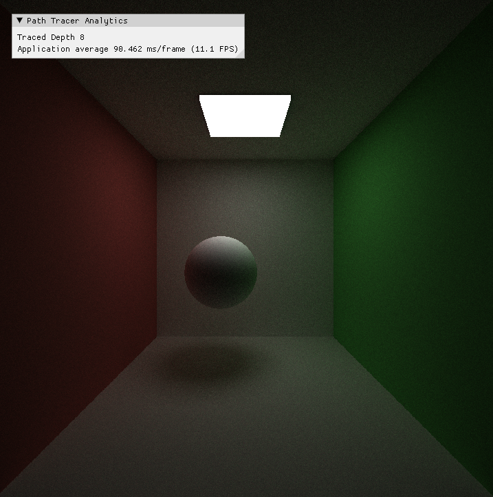 | 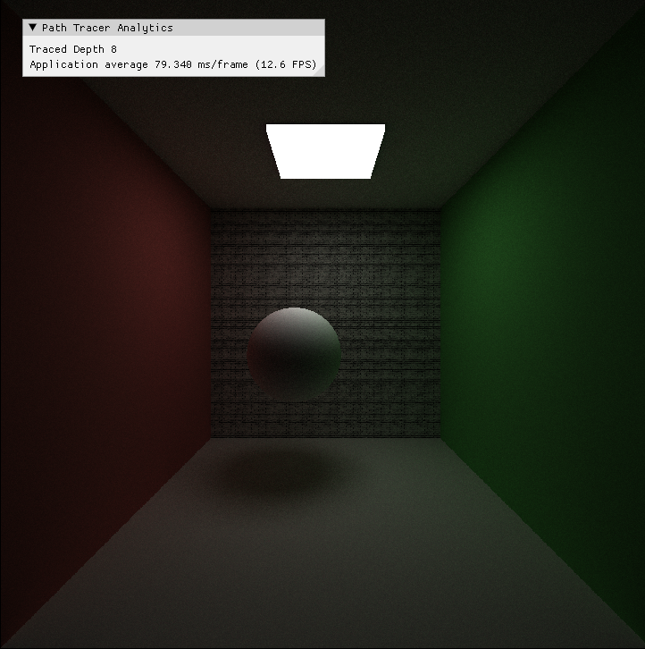 |

The following images were rendered using the same scene, camera, lighting configuration, and iteration count. The only difference between the two renders is whether bump mapping is enabled.

| Bump Mapping OFF                                  | Bump Mapping ON                                 |
| ------------------------------------------------- | ----------------------------------------------- |
|  | 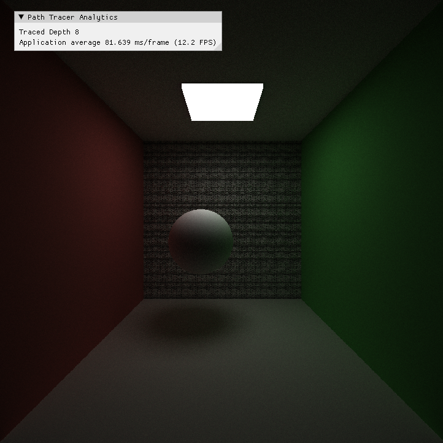 |

The difference is easier to observe when the textured back wall is viewed more closely. With bump mapping disabled, the brick pattern changes only the surface color. With bump mapping enabled, the perturbed normals introduce additional local lighting variation around the brick structure.

<table>
  <tr>
    <th align="center">Back Wall - Bump OFF</th>
    <th align="center">Back Wall - Bump ON</th>
  </tr>
  <tr>
    <td align="center">
      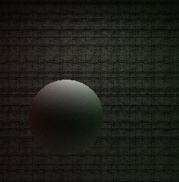
    </td>
    <td align="center">
      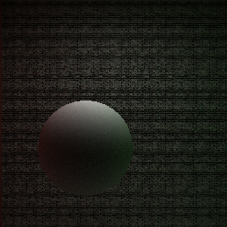
    </td>
  </tr>
</table>

To compare the performance of procedural and file-loaded textures, the same scene and rendering settings were used while changing only the texture evaluation method. Bump mapping was disabled for the procedural-versus-file comparison. A third configuration enables bump mapping to measure its additional cost.

| Configuration                  | Time / Frame |  FPS |
| ------------------------------ | -----------: | ---: |
| Procedural Texture             |    73.549 ms | 13.6 |
| File-Loaded Texture - Bump OFF |    79.355 ms | 12.6 |
| File-Loaded Texture - Bump ON  |    79.956 ms | 12.5 |

The procedural texture required **73.549 ms/frame**, while the file-loaded texture required **79.355 ms/frame**, corresponding to an approximately **7.9% increase in frame time**. Procedural textures determine the surface color directly from the intersection position using arithmetic operations, while file-loaded textures additionally require indexed accesses to image data stored in GPU memory. Enabling bump mapping increased the frame time only slightly, from **79.355 ms/frame** to **79.956 ms/frame**, an increase of approximately **0.8%**. Bump mapping requires four neighboring height samples and an additional surface-normal calculation for each affected intersection, but the measured overhead remained small relative to the total path tracing workload in this scene.

#### Analysis

#### Analysis

The results demonstrate the difference between texture mapping and bump mapping. Texture mapping changes the surface color using image data, while bump mapping changes the surface normal used during lighting and ray scattering. With bump mapping disabled, the brick pattern is visible because of the color texture, but the wall still responds to lighting as a geometrically flat surface. When bump mapping is enabled, variations in the height map perturb the normal direction, producing additional local lighting variation and making the brick surface appear more three-dimensional.

The actual geometry is never displaced. Therefore, bump mapping can represent small-scale surface detail without adding additional geometry or increasing ray-geometry intersection complexity. The performance results also show that file-loaded textures introduce a moderate overhead compared with procedural textures. The procedural texture required **73.549 ms/frame**, while the file-loaded texture required **79.355 ms/frame**, an increase of approximately **7.9%**. This is expected because procedural textures rely mainly on arithmetic operations, while file-loaded textures require additional indexed memory accesses to texture data stored in GPU memory.

Enabling bump mapping increased the frame time only slightly, from **79.355 ms/frame** to **79.956 ms/frame**, corresponding to an approximately **0.8%** increase. Although bump mapping requires four neighboring height samples and an additional normal perturbation calculation at each affected surface intersection, this overhead is small relative to the total path tracing workload in the tested scene. The texture data is uploaded to GPU memory during initialization and remains resident on the GPU during rendering, avoiding repeated CPU-to-GPU transfers each frame.

#### GPU vs. Hypothetical CPU Implementation

Texture mapping and bump mapping are two techniques that are ideal for GPU processing because the computations for each intersection with the surface are independent of one another. The computation of texture look-up and perturbed normals can be achieved independently by thousands of CUDA threads with active rays.If we were to design such an implementation using a CPU, we would use many fewer CPU threads for doing the same thing, namely, performing the texture look-up, calculating the neighboring height samples, gradient calculation, and perturbation of normals. The procedural textures involve mostly arithmetic operations, while file textures involve memory look-ups besides other operations. Bump mapping adds to the number of texture samples since multiple neighboring height samples are needed at each surface intersection.

#### Further Optimization

Currently, the application uses manual texture fetching from a global memory buffer on the GPU. An idea to optimize is to employ CUDA texture objects that offer special texture cache as well as addressing and filtering capabilities. The current texture look-up based on nearest neighbor approach can be substituted with bilinear filtering to ensure better magnification of the textures. With respect to the bump mapping technique, one can precompute a normal map instead of fetching the four closest height-map values and computing the gradient. Lastly, currently the texture coordinates are computed on the basis of the surface intersection coordinates. One could extend the algorithm to use explicitly defined UV coordinates.

### 2.10 OBJ Mesh Loading

I implemented OBJ mesh loading to allow the path tracer to render arbitrary triangle meshes in addition to the original built-in primitives. The OBJ loader runs during scene initialization and reads vertex positions from `v` entries and face definitions from `f` entries. Each vertex is transformed immediately using the translation, rotation, and scale specified for the OBJ object in the scene file.

```cpp
if (type == "v")
{
    float x;
    float y;
    float z;

    ss >> x >> y >> z;

    glm::vec4 transformed = transform * glm::vec4(x, y, z, 1.0f);
    vertices.push_back(glm::vec3(transformed));
}
```

OBJ face entries may contain slash-separated indices such as: v/vt/vn. For the current implementation, only the vertex-position index is required. The loader extracts the portion before the first `/`.

```cpp
size_t slashPos = token.find('/');
std::string vertexIndexString = token.substr(0, slashPos);
int vertexIndex = std::stoi(vertexIndexString) - 1;
faceIndices.push_back(vertexIndex);
```

Faces containing more than three vertices are converted into triangles using fan triangulation.

```cpp
for (int i = 1; i < static_cast<int>(faceIndices.size()) - 1; i++)
{
    Triangle tri;

    tri.v0 = vertices[faceIndices[0]];
    tri.v1 = vertices[faceIndices[i]];
    tri.v2 = vertices[faceIndices[i + 1]];

    tri.normal = glm::normalize(glm::cross(tri.v1 - tri.v0, tri.v2 - tri.v0));
    tri.materialId = materialId;

    triangles.push_back(tri);
}
```

Each triangle stores three world-space vertices, a flat face normal, and a material ID.

```cpp
struct Triangle
{
    glm::vec3 v0;
    glm::vec3 v1;
    glm::vec3 v2;

    glm::vec3 normal;

    int materialId;
};
```

The loaded triangle array is transferred to GPU memory before rendering. Ray-triangle intersection is performed on the GPU using the Möller-Trumbore intersection algorithm.

```cpp
glm::vec3 edge1 = triangle.v1 - triangle.v0;
glm::vec3 edge2 = triangle.v2 - triangle.v0;

glm::vec3 h = glm::cross(ray.direction, edge2);
float a = glm::dot(edge1, h);

if (fabsf(a) < EPSILON)
{
    return -1.0f;
}
```

The barycentric coordinates are then tested to determine whether the ray intersects the interior of the triangle.

```cpp
float f = 1.0f / a;

glm::vec3 s = ray.origin - triangle.v0;
float u = f * glm::dot(s, h);

if (u < 0.0f || u > 1.0f)
{
    return -1.0f;
}

glm::vec3 q = glm::cross(s, edge1);
float v = f * glm::dot(ray.direction, q);

if (v < 0.0f || u + v > 1.0f)
{
    return -1.0f;
}
```

The triangle normal is reversed when necessary so that it faces against the incoming ray.

```cpp
normal = triangle.normal;

if (glm::dot(normal, ray.direction) > 0.0f)
{
    normal = -normal;
}
```

OBJ objects can be added directly through the JSON scene description and use the same translation, rotation, and scale parameters as the other geometry in the renderer.

```json
{
    "TYPE": "obj",
    "FILE": "models/model.obj",
    "MATERIAL": "diffuse_white",
    "TRANS": [0.0, 0.0, 0.0],
    "ROTAT": [0.0, 0.0, 0.0],
    "SCALE": [1.0, 1.0, 1.0]
}
```

#### Visual and Performance Comparison

The following result demonstrates a third-party OBJ model successfully imported, triangulated, transformed, and rendered using the CUDA path tracer.

<p align="center">
  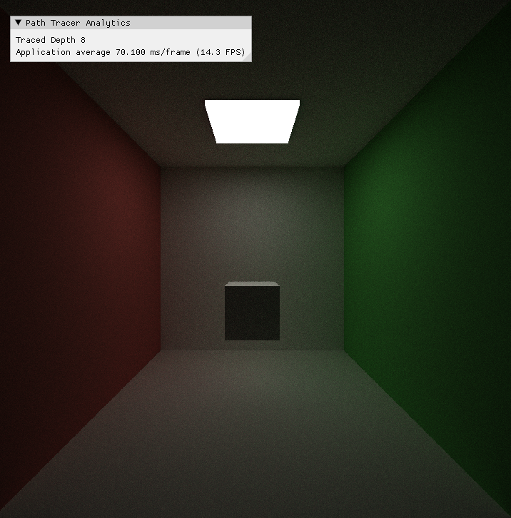
</p>

For this feature, the primary goal was to verify correct loading and rendering of arbitrary triangle meshes. Performance optimization for large meshes is evaluated separately in the BVH Acceleration section below.

#### Analysis

The OBJ loader improves the renderer from supporting a set of analytically defined primitives to supporting arbitrary mesh geometry based on triangles. First, the loader loads an OBJ file and turns all faces into one or more `Triangle` data structures. Since all faces are triangulated using fan algorithm, only one geometry type is needed by the intersection stage, no matter how many vertices the face initially had.

In addition, the object's transformation matrix is applied while loading, meaning that triangles loaded to GPU are located in world space and thus do not need to be transformed every time they are checked by intersection test. A drawback of the current implementation of the loader is that only positions of vertices are parsed from OBJ faces indices. Indices of texture coordinates and vertex normals are not supported at this point. Thus each triangle has a normal vector computed using positions of all three vertices.

Initial implementation of the loader performed intersection test of each ray with each triangle. While producing the correct result, it is computationally very inefficient for complex geometry and became a direct motivation for BVH implementation, described in the next section.

#### GPU vs. Hypothetical CPU Implementation

Parsing of the OBJ file is done on the CPU since it is an initialization task that requires text manipulation, dynamic containers, and triangulation of polygons. Once the parsing process has been completed, the outputted array of triangles is uploaded into GPU memory. The intersection of rays and triangles is done on the GPU. Every path can test its geometry independently; hence thousands of rays can run concurrently. An example of how the ray tracing process could be implemented on a CPU is by using the same Möller-Trumbore algorithm, but in this case, there will be much less parallelization when processing many independent rays. The chosen implementation therefore keeps the irregular one-time parsing work on the CPU while moving the highly parallel intersection workload to the GPU.

#### Further Optimization

The OBJ loader could be extended to import vertex normals and texture coordinates from `vn` and `vt` entries. These values could then be interpolated using barycentric coordinates to support smooth shading and texture mapping directly on OBJ meshes.

Support for `.mtl` files could also allow a single OBJ model to contain multiple materials.

The current implementation calculates one flat normal for each generated triangle. Smooth vertex normals would improve the appearance of curved surfaces without increasing the geometric complexity of the mesh.

Most importantly, brute-force intersection testing scales poorly as triangle count increases. The BVH acceleration structure described below addresses this problem by rejecting large groups of triangles before individual ray-triangle tests are performed.

### 2.11 BVH Acceleration

To accelerate intersection testing for complex OBJ meshes, I implemented a Bounding Volume Hierarchy (BVH). Without acceleration, every active ray must be tested against every triangle in the mesh. For large models, this brute-force approach produces an extremely large number of ray-triangle intersection tests. The BVH groups triangles into a hierarchy of axis-aligned bounding boxes so that large portions of the mesh can be rejected using relatively inexpensive ray-box intersection tests. Each BVH node stores its bounding box and either two child-node indices or a range of triangles when the node is a leaf.

```cpp
struct BVHNode
{
    glm::vec3 minBounds;
    glm::vec3 maxBounds;

    int leftChild;
    int rightChild;

    int triangleStart;
    int triangleCount;
};
```

The BVH is constructed recursively on the CPU after all OBJ triangles have been loaded. For each node, the bounds of every triangle in the node are combined to produce the node's axis-aligned bounding box.

```cpp
glm::vec3 triMin;
glm::vec3 triMax;

getTriangleBounds(triangles[i], triMin, triMax);

minBounds = glm::min(minBounds, triMin);
maxBounds = glm::max(maxBounds, triMax);
```

The implementation also computes the bounds of the triangle centroids. The longest centroid axis is selected as the splitting axis.

```cpp
glm::vec3 extent = centroidMax - centroidMin;
int axis = 0;

if (extent.y > extent.x && extent.y >= extent.z)
{
    axis = 1;
}
else if (extent.z > extent.x && extent.z > extent.y)
{
    axis = 2;
}
```

Triangles are partitioned around the median centroid using `std::nth_element`.

```cpp
int mid = start + triangleCount / 2;

std::nth_element(
    triangles.begin() + start,
    triangles.begin() + mid,
    triangles.begin() + end,
    [axis](const Triangle& a, const Triangle& b)
    {
        return getTriangleCentroid(a)[axis] < getTriangleCentroid(b)[axis];
    });
```

A node becomes a leaf when it contains four or fewer triangles.

```cpp
if (triangleCount <= 4)
{
    nodes[nodeIndex].leftChild = -1;
    nodes[nodeIndex].rightChild = -1;
    nodes[nodeIndex].triangleStart = start;
    nodes[nodeIndex].triangleCount = triangleCount;

    return nodeIndex;
}
```

After construction, the complete BVH node array is copied to GPU memory. BVH traversal is performed iteratively on the GPU using an explicit stack.

```cpp
int stack[64];
int stackSize = 0;
stack[stackSize++] = 0;

while (stackSize > 0)
{
    int nodeIndex = stack[--stackSize];
    BVHNode node = bvhNodes[nodeIndex];

    if (!rayAABBIntersection(
        pathSegment.ray,
        node.minBounds,
        node.maxBounds,
        t_min))
    {
        continue;
    }

    // Process leaf triangles or continue to child nodes.
}
```

When a leaf node is reached, only the triangles contained in that leaf require full ray-triangle intersection tests.

```cpp
if (node.triangleCount > 0)
{
    int end = node.triangleStart + node.triangleCount;

    for (int i = node.triangleStart; i < end; i++)
    {
        glm::vec3 triIntersect;
        glm::vec3 triNormal;

        float triT = triangleIntersectionTest(
            triangles[i],
            pathSegment.ray,
            triIntersect,
            triNormal);

        if (triT > 0.0f && triT < t_min)
        {
            t_min = triT;
            hitMaterialId = triangles[i].materialId;
            intersect_point = triIntersect;
            normal = triNormal;
            hitOutside = true;
        }
    }
}
```

This toggle allows the acceleration structure to be directly compared against the original brute-force implementation.

#### Visual and Performance Comparison

The BVH and brute-force implementations were tested using the same complex OBJ scene, resolution, camera configuration, path depth, and rendering settings. The only changed setting was `BVH_ACCELERATION`. Because the brute-force version was extremely slow for this model, the comparison was measured after approximately 10 iterations.

| Configuration | Average Frame Time |      FPS |
| ------------- | -----------------: | -------: |
| BVH OFF       |  7320.221 ms/frame |  0.1 FPS |
| BVH ON        |    72.444 ms/frame | 13.8 FPS |

Therefore, enabling BVH acceleration reduced the measured frame time by approximately **99.01%** and produced approximately a **101.05× speedup** for this complex OBJ scene.

#### Analysis

The performance difference demonstrates why an acceleration structure becomes essential when rendering high-triangle-count meshes. With BVH disabled, every active ray performs a brute-force loop over the entire triangle array. If a mesh contains `N` triangles, each ray may require up to `N` expensive Möller-Trumbore intersection tests.

In the case of complex geometry and hundreds of thousands of rays, this leads to an incredible amount of redundant intersection computation. On the benchmarked scene, the naive algorithm took roughly **7320.221 ms/frame**, while BVH-based ray-tracing reduced it to just **72.444 ms/frame**. Additional computations come from the intersection of rays and bounding boxes, as well as traversal through the tree. But these operations are significantly less expensive than the operation of testing every single triangle. In case of a complex geometry, a vast majority of rays intersect just a few nodes of the BVH and check only a fraction of the triangle list.

But then, there is also a strong dependency of the performance gain offered by the BVH on the complexity of the scene. In the case of very small meshes, the performance overhead involved in the traversal of the BVH will be similar to that of the simple test of the few triangles that exist. But as mesh complexity grows higher, the number of triangles whose test is spared will increase dramatically, hence increasing the efficiency of the acceleration data structure. But the final output is not affected.

#### GPU vs. Hypothetical CPU Implementation

The BVH is built on the CPU when the scene is initialized. CPU construction is advantageous because constructing the BVH entails a recursive subdivision step, rearrangement of triangles, computation of centroids, and `std::nth_element`. The BVH construction step is done just once before the rendering step starts. Afterwards, the sorted list of triangles and the BVH node list are loaded into the GPU's memory. Traversing the BVH happens independently for each ray on the GPU. Since the renderer could handle hundreds of thousands of rays at the same time, GPU execution results in huge parallelism. Each CUDA thread traverses the BVH in the same manner but for different rays.

#### Further Optimization

The current BVH implements a median split on the longest axis of the centroid. It provides a fairly well-balanced tree and is easy to implement but doesn't optimize expected ray traversal costs directly. An alternative approach might be to employ the **Surface Area Heuristic (SAH)** when evaluating candidate splits and choosing those that are more likely to result in minimized intersection calculations. The current algorithm pushes both children onto the stack without checking which one is closer to the ray. Checking bounding boxes of two children first and traversing the closest one ahead of the other can save some computation time. An intersection with a triangle that is closer will provide an opportunity to decrease `t_min` earlier and exclude other bounding boxes. The threshold for leaves is set to four triangles at the moment.

The effect of using various leaf sizes may reveal the right compromise between tree traversal costs and the number of ray-triangle intersection calculations. Moreover, the size of the node in the BVH could also be optimized for better performance in terms of memory locality and reduced bandwidth on the GPU. Lastly, more advanced GPU-friendly acceleration data structures can help minimize branch divergence and improve cache coherence of neighboring threads.

## Part 3 - Final Model Credit

The final complex mesh used to demonstrate OBJ mesh loading and benchmark BVH acceleration is **Pegasus Statue sculpture statuette figurine horse**, created by **Dean3000** and downloaded from **CGTrader**.

The model was provided as an OBJ mesh and was used as third-party geometry only. All OBJ loading, triangulation, ray-triangle intersection, BVH construction, and GPU BVH traversal were implemented as part of this renderer.

For the final scene, I placed the Pegasus on a dark pedestal and constructed a warm emissive halo using cube primitives. I configured warm key lighting and cool blue rim lighting to emphasize the statue's shape, and added a glass sphere to demonstrate reflection and refraction. The render uses stochastic antialiasing, low-discrepancy sampling, and linear-to-sRGB conversion for the final PNG output.

**Model:** Pegasus Statue sculpture statuette figurine horse  
**Creator:** Dean3000  
**Source:** CGTrader  
**License:** Royalty Free License (no AI)